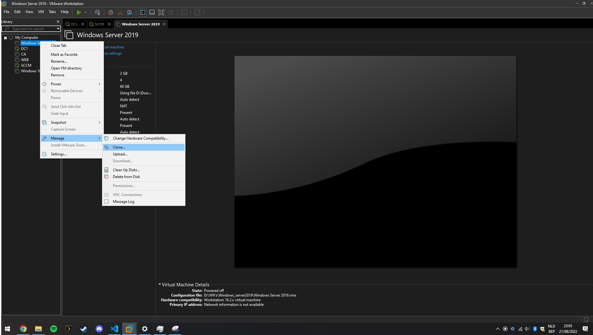
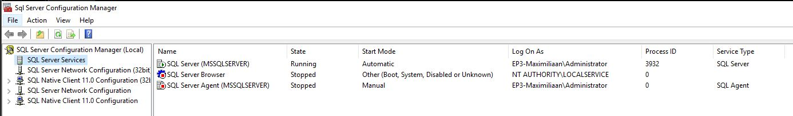

# Portfolio Windows Server II
## Inleiding

- [Portfolio Windows Server II](#portfolio-windows-server-ii)
  - [Inleiding](#inleiding)
  - [Software en nodige packages](#software-en-nodige-packages)
  - [Golden Image aanmaken met VMWare](#golden-image-aanmaken-met-vmware)
    - [Opzetten VM](#opzetten-vm)
    - [Windows Server 2019 Installatie](#windows-server-2019-installatie)
    - [Kopiëren van nodige scripts & packages naar VM](#kopiëren-van-nodige-scripts--packages-naar-vm)
    - [VM opzetten aan de hand van de golden image in VMWare](#vm-opzetten-aan-de-hand-van-de-golden-image-in-vmware)
  - [Domeincontroller - EP3-DC-ALFA](#domeincontroller---ep3-dc-alfa)
    - [Aanmaken VM](#aanmaken-vm)
    - [Opzetten domeincontroller](#opzetten-domeincontroller)
  - [Certificatie server - EP3-CA](#certificatie-server---ep3-ca)
    - [Aanmaken VM](#aanmaken-vm-1)
    - [Opzetten Certificate Authority server](#opzetten-certificate-authority-server)
  - [WEB server - EP3-WEB](#web-server---ep3-web)
    - [Aanmaken VM](#aanmaken-vm-2)
    - [Opzetten WEB server](#opzetten-web-server)
  - [Deployment server - EP3-SCCM](#deployment-server---ep3-sccm)
    - [Aanmaken VM](#aanmaken-vm-3)
    - [Opzetten Deployment server](#opzetten-deployment-server)
      - [Eerste configuratie script](#eerste-configuratie-script)
      - [Tweede configuratie script](#tweede-configuratie-script)
  - [Deploy Windows 10 workstation met SCCM](#deploy-windows-10-workstation-met-sccm)
    - [Windows 10 ISO  mounten](#windows-10-iso--mounten)
    - [Import Windows 10 Operating System Image](#import-windows-10-operating-system-image)
    - [Create Application](#create-application)
    - [Distribute Operating System Image](#distribute-operating-system-image)
    - [Create Task Sequence to deploy an OS](#create-task-sequence-to-deploy-an-os)
    - [Deploy Windows 10 Pro Task Sequence](#deploy-windows-10-pro-task-sequence)
  - [Tabel met nuttige informatie](#tabel-met-nuttige-informatie)
  - [Scripts](#scripts)
    - [Script Domeincontroller - EP3-DC-ALFA](#script-domeincontroller---ep3-dc-alfa)
    - [Script Certificatie server - EP3-CA](#script-certificatie-server---ep3-ca)
    - [Script WEB server - EP3-WEB](#script-web-server---ep3-web)
    - [Scripts Deployment server - EP3-SCCM](#scripts-deployment-server---ep3-sccm)
      - [SQL.ps1](#sqlps1)
      - [SCCM.ps1](#sccmps1)

## Software en nodige packages

Voor we beginnen zorgen we eerst dat we de nodige software en packages hebben.
Download deze eerst en zet ze allemaal samen in een map genaamd `packages`. Later gaan we in deze handleiding verder met deze folder.

- [Windows Server 2019 ISO - download page](https://www.microsoft.com/en-us/evalcenter/download-windows-server-2019)
- [Windows 10 ISO - dowload page](https://www.microsoft.com/en-us/software-download/windows10)
- [Windows 10 ADK - Package download link](http://go.microsoft.com/fwlink/p/?LinkId=526740&ocid=tia-235208000)
- [Microsoft Deployment Toolkit (MDT) - Package download page](https://www.microsoft.com/en-us/download/details.aspx?id=54259)
- [Microsoft SQL Server 2019 - EXE download page](https://www.microsoft.com/en-us/evalcenter/evaluate-sql-server-2019)
- [SQL Server Management Studio (SSMS) - dowload page](https://docs.microsoft.com/en-us/sql/ssms/download-sql-server-management-studio-ssms?view=sql-server-ver16)
- **Config.ini** (maak deze file aan en kopieer onderstaande code naar de file)
  - Nodig om SCCM/MECM via een Powershell script te installeren
  - ```
    [Identification]
    Action=InstallPrimarySite

    [Options]
    ProductID=Eval
    SiteCode=BEL
    SiteName=EP3-Maximiliaan.HoGent
    SMSInstallDir="C:\SCCM_Install"
    SDKServer=EP3-SCCM.EP3-Maximiliaan.hogent
    RoleCommunicationProtocol=HTTPorHTTPS
    ClientsUsePKICertificate=0
    MobileDeviceLanguage=0
    ManagementPoint=EP3-SCCM.EP3-Maximiliaan.hogent
    ManagementPointProtocol=HTTP
    DistributionPoint=EP3-SCCM.EP3-Maximiliaan.hogent
    DistributionPointProtocol=HTTP
    DistributionPointInstallIIS=0
    AdminConsole=1

    [SQLConfigOptions]
    SQLServerName=EP3-SCCM.EP3-Maximiliaan.hogent
    DatabaseName=EP3_SCCM
    SQLSSBPort=4022 

    ```
- [PuTTY - Application download page](https://www.chiark.greenend.org.uk/~sgtatham/putty/latest.html)

Onderaan in het tweede deel van deze handleiding vindt u alle scripts die we nodig zullen hebben. Kopieer deze scripts en voeg ze toe in een folder genaamd `scripts`. dit zijn in totaal 5 scripts.

- [DC1.ps1](#script-domeincontroller---ep3-dc-alfa)
- [CA.ps1](#script-certificatie-server---ep3-ca)
- [WEB.ps1](#script-web-server---ep3-web)
- [SQL.ps1](#sqlps1)
- [SCCM.ps1](#sccmps1)

## Golden Image aanmaken met VMWare
### Opzetten VM
Om gemakkelijk en efficiënt VM's uit te rollen maken we golden image aan van Windows Server 2019. Om dit te doen openen we VMWare Workstation Pro en kiezen we voor "New Virtual Machine". 

Als type VM kiezen we voor "Typical". In het volgende scherm duiden we de laatste optie aan: "I will install the operating system later." en klik vervolgens op next.


Kies voor "Microsoft Windows" met "Windows Server 2019" als version.


Kies de naam en locatie waar de VM word opgeslagen.


Kies de schijfgrootte en vink "Store virtual disk as a single file" aan.


Overloop de gegevens en klik op finish


In VMWare rechterklik op de nieuw aangemaakte VM en selecteer "Settings". Klik op "CD/DVD (SATA)" en kies voor "Use ISO image file". Navigeer naar de locatie waar de Windows Server 2019 iso file staat op de host PC. 

Zet Memory op 2 GB en het aantal Processors op 2 (voor betere performance).

Klik op Ok


### Windows Server 2019 Installatie

Start de VM op en doorga het Windows installatie proces.

1. Kies taal, tijd en keyboard layout van de server. Klik op next.
2. Klik op Install now
3. Kies Windows Server 2019 Standard Evaluation (Desktop Expierence) voor een Windows met GUI en klik op next.
4. Accepteer de 'License terms' en klik op next.
5. Kies Custom: Install Windows only (advanced)
6. Kies de partitie en klik op next.
7. De installatie begint, wacht tot het klaar is.
8. Het systeem zal automatisch rebooten na de installatie
9. Stel de Administrator gegevens in 
   1.  Username = Administrator
   2.  Password = Administr@tor2022
10. Klik op finish om de installatie te volbrengen.
11. Ctrl + Alt + Del om te ontgrendelen
12. Log in met de Administrator gegevens

`Merk op doordat we de Administrator gegevens configuren op de golden image, deze overal dezelfde zal zijn als we deze image gebruiken om een nieuwe VM te klonen.`

### Kopiëren van nodige scripts & packages naar VM

Aan de hand van een shared folder gaan we de nodige files van het host systeem naar de VM kopieëren. Rechtermuisklik op de VM en kies opnieuw voor "Settings". Kies bovenaan voor "Options" en klik op "Shared folders". Kies voor "Always enabled" en voeg de gewenste folder waar de scripts en nodige packages staan op het hostsysteem toe.


We plaatsen de folder met `scripts` en de folder met `packages` op de C: schijf van de VM in gepaste folders zoals hieronder aangetoond.


Nu kunnen we deze VM afsluiten en is onze golden image klaar om mee aan de slag te gaan

### VM opzetten aan de hand van de golden image in VMWare

Rechtermuisklik op de VM, klik op "Manage", kies voor "clone



Kies voor "The current state of the virtual machine" en klik op Volgende.


Kies voor "Create a full clone" en klik op Volgende.


Geef de VM een gepaste naam en geef de locatie op waar de VM moet worden opgeslagen.

Klik op Voltooien om de VM aan te maken.


## Domeincontroller - EP3-DC-ALFA

### Aanmaken VM

We maken een clone aan van onze golden image VM zoals we in [VM opzetten aan de hand van de golden image in VMWare](#vm-opzetten-aan-de-hand-van-de-golden-image-in-vmware) hebben besproken.

Omdat onze domeincontroller ook fungeert als toegang tot het internet voor het interne netwerk van deze opstelling is ook een 2de netwerkadapter vereist.

Rechtermuisklik op de VM en kies opnieuw voor "Settings". Bij "hardware" klik onderaan op "Add" en kies voor "Network Adapter". De eerste netwerk adapter configureren we als NAT. De tweede adapter als  Host-only.


### Opzetten domeincontroller

Start de VM en login met de Administrator gegevens.

Open Windows Verkenner en ga naar de C: schijf, open de folder scripts die we op de golden image hebben gekopieëerd. 

Rechtermuisklik ergens in de map en kies "Open Powershell window here"


Voer het [DC1.ps1](#script-domeincontroller---ep3-dc-alfa) Powershell script uit om de domeincontroller te configureren.

```ps1
PS C:\scripts> .\DC1.ps1
```

Het script bevat 6 functies met elk een reeks aan Powershell commando's, die achter elkaar worden uitgevoerd.

- changeHostname
  - Veranderd de hostname van de computer naar `EP3-DC-ALFA`
- changeNetworkSettings
  - Zet het IP-adres van de computer naar `192.168.10.200` op netwerkadapter "Ethernet1" voor het interne netwerk (De Host-only adapter in VMWare)
  - Zet DNS serveradres die gekoppeld zijn aan de netwerkadapter
- ChangeDomain
  - Installeert de `AD-Domain-Services` feature
  - Creëert een nieuwe Active Directory forest met domeinnaam: `EP3-Maximiliaan.hogent`
- changeDNS
  - Voegt een nieuwe DNS server toe van Google, namelijk `8.8.8.8`
- changeDHCP
  - Installeert DHCP
  - Definieert de DHCP scope met range van `192.168.10.100` tot `192.168.10.150`
  - Zet de DNS server en default gateway op zichzelf, namelijk `192.168.10.200`
  - Voegt DHCP option 66 & 67 toe voor PXE boot
  - Zet leasing van IPv4 adressen op 24uur
  - Restart de DHCP server
- changeRRAS
  - Installeert routing
  - Configureert NAT (zodat internal netwerk internet toegang kan krijgen)
  - Restart de computer om de aanpassingen toe te passen

Als het script succesvol is uitgevoerd dan zou de computer automatisch herstarten. Als we nu in "Server Manager" naar het dashboard kijken zien we dat er roles zijn bijgekomen, zoals "AD DS", "DHCP" en "DNS"


Ook zien we "Active Directory Users and Computer" de domeincontroller staan.


Als we op "Local Server" klikken kunnen we zien dat de "Computer name" is veranderd naar `EP3-DC-ALFA` en "Domain" is veranderd in `EP3-Maximiliaan.hogent`.

We zien bij "Ethernet0" (de NAT adapter) dat het IP-adres door DHCP geregeld wordt en bij "Ethernet1" (de Host-only adapter) het interne IP-adres `192.168.10.200`.


## Certificatie server - EP3-CA

### Aanmaken VM

We maken een clone aan van onze golden image VM zoals we in [VM opzetten aan de hand van de golden image in VMWare](#vm-opzetten-aan-de-hand-van-de-golden-image-in-vmware) hebben besproken.

Deze VM mag enkel een Host-only adapter hebben.

### Opzetten Certificate Authority server

Start de VM en login met de Administrator gegevens.

Open Windows Verkenner en ga naar de C: schijf, open de folder scripts die we op de golden image hebben gekopieëerd. 

Rechtermuisklik ergens in de map en kies "Open Powershell window here"


Voer het [CA.ps1](#script-certificatie-server---ep3-ca) Powershell script uit om de Certificatie server te configureren.

```ps1
PS C:\scripts> .\CA.ps1
```

Het script bevat 5 functies met elk een reeks aan Powershell commando's, die achter elkaar worden uitgevoerd.

- changeHostname
  - Veranderd de hostname van de computer naar `EP3-CA`
- changeNetworkSettings
  - Zet het IP-adres van de computer naar `192.168.10.230` op netwerkadapter "Ethernet0"
  - Zet DNS en default gateway op de domeincontroller, `192.168.10.200`
- joinDomain
  - Voegt de computer toe aan het domein `EP3-Maximiliaan.hogent`
- changePrerequisites
  - Installeert de vereiste features voor de AD CS Certification Authority role service
- installCA
  - Installeert AD CS Certification Authority role service
  - Restart de computer om de aanpassingen toe te passen
  
Als het script succesvol is uitgevoerd dan zou de computer automatisch herstarten. Als we nu in "Server Manager" naar het dashboard kijken zien we dat de role "AD CS" is toegevoegd.


Op de domeincontroller kunnen we terug in "Active Directory Users and Computer" zien dat de server `EP3-CA` tot het domein behoort.


Bij "Local Server" zien we dat "Computer name" is veranderd naar `EP3-CA` en "Domain" is veranderd in `EP3-Maximiliaan.hogent`. Het IP adres van "Ethernet0" staat ingesteld op `192.168.10.230`.


## WEB server - EP3-WEB

### Aanmaken VM

We maken een clone aan van onze golden image VM zoals we in [VM opzetten aan de hand van de golden image in VMWare](#vm-opzetten-aan-de-hand-van-de-golden-image-in-vmware) hebben besproken.

Deze VM mag enkel een Host-only adapter hebben.

### Opzetten WEB server

Start de VM en login met de Administrator gegevens.

Open Windows Verkenner en ga naar de C: schijf, open de folder scripts die we op de golden image hebben gekopieëerd. 

Rechtermuisklik ergens in de map en kies "Open Powershell window here"


Voer het [ISS.ps1](#script-web-server---ep3-web) Powershell script uit om de WEB server te configureren.

```ps1
PS C:\scripts> .\ISS.ps1
```

Het script bevat 4 functies met elk een reeks aan Powershell commando's, die achter elkaar worden uitgevoerd.

- changeHostname
  - Veranderd de hostname van de computer naar `EP3-WEB`
- changeNetworkSettings
  - Zet het IP-adres van de computer naar `192.168.10.220` op netwerkadapter "Ethernet0"
  - Zet DNS en default gateway op de domeincontroller, `192.168.10.200`
- joinDomain
  - Voegt de computer toe aan het domein `EP3-Maximiliaan.hogent`
- serverProvisioning
  - Zet de tijdzone naar `Central Europe Standard Time`
  - Disable de firewall
  - Installeert IIS en optionele features
  - Installeert ASP.NET vereisten
  - Configureert HTTPS met een certificate
  - Zet een default website op
  - Restart de computer om de aanpassingen toe te passen

Als het script succesvol is uitgevoerd dan zou de computer automatisch herstarten. Als we nu in "Server Manager" naar het dashboard kijken dan zien we de role "IIS".


Op de domeincontroller kunnen we terug in "Active Directory Users and Computer" zien dat de server `EP3-WEB` tot het domein behoort.


Bij "Local Server" zien we dat "Computer name" is veranderd naar `EP3-WEB` en "Domain" is veranderd in `EP3-Maximiliaan.hogent`. Het IP adres van "Ethernet0" staat ingesteld op `192.168.10.220`.


We kunnen via onze domeincontroller een webbrowser openen en surfen naar `https://ep3-web` om te kijken of de webserver bereikbaar is.


We zien dat de browser een melding geeft dat de site niet secure is maar dat komt door het certificate dat we aanmaken. Als we doorgaan naar de website zien we dat deze bereikbaar is over HTTPS. Doordat we de website kunnen bereiken met zijn hostnaam (i.p.v. het IP-adres `192.168.10.220`) betekent dat de DNS correct geconfigureert is op de domeincontroller.

## Deployment server - EP3-SCCM

### Aanmaken VM

We maken een clone aan van onze golden image VM zoals we in [VM opzetten aan de hand van de golden image in VMWare](#vm-opzetten-aan-de-hand-van-de-golden-image-in-vmware) hebben besproken.

Deze VM mag enkel een Host-only adapter hebben. We passen ook de "Hard Disk" aan, we vergroten de schijf naar `100 GB`. Dit doen we doordat de software die op deze server zal geïnstalleerd worden over het standaard geconfigureerde 60 GB zal zijn. Hierdoor zullen er geen problemen voorkomen en heeft de machine genoeg plaats om de software te kunnen installeren.

Dit doen we door in de VM settings bij hardware op "Hard Disk" te klikken. In het rechter venster bij "Expand disk capacity" klikken we op "Expand" (Enkel mogelijk als de VM uit staat).


Geef het nieuwe totale grootte op voor de virtuele schijf: `100.0 GB` en klik op "Expand"


### Opzetten Deployment server

Start de VM en login met de Administrator gegevens.

Open Windows Verkenner en ga naar de C: schijf, open de folder scripts die we op de golden image hebben gekopieëerd. 

Rechtermuisklik ergens in de map en kies "Open Powershell window here"


#### Eerste configuratie script

Voer eerst het [SQL.ps1](#sqlps1) Powershell script uit uit om de deployment server te configureren.

```ps1
PS C:\scripts> .\SQL.ps1
```

Het script bevat 5 functies met elk een reeks aan Powershell commando's, die achter elkaar worden uitgevoerd.

- changeHostname
  - Veranderd de hostname van de computer naar `EP3-SCCM`
- changeNetworkSettings
  - Zet het IP-adres van de computer naar `192.168.10.225` op netwerkadapter "Ethernet0"
  - Zet DNS en default gateway op de domeincontroller, `192.168.10.200`
- joinDomain
  - Voegt de computer toe aan het domein `EP3-Maximiliaan.hogent`
- changeSQL
  - Installeert Microsoft SQL Server 2019 a.d.h.v. de `SQLServer.exe` in de folder packages die we naar de golden image hebben gekopieerd.
- changeSSMS
  - Installeert SQL Server Management Studio (SSMS) a.d.h.v. de `SSMS-Setup-ENU.exe` in de folder packages die we naar de golden image hebben gekopieerd.
  - Restart de computer om de aanpassingen toe te passen

Als het script succesvol is uitgevoerd dan zou de computer automatisch herstarten. Op de domeincontroller kunnen we terug in "Active Directory Users and Computer" zien dat de server `EP3-SCCM` tot het domein behoort.


Bij "Local Server" zien we dat "Computer name" is veranderd naar `EP3-SCCM` en "Domain" is veranderd in `EP3-Maximiliaan.hogent`. Het IP adres van "Ethernet0" staat ingesteld op `192.168.10.225`.


Om te kijken of Microsoft SQL Server 2019 daadwerkelijk geïnstalleerd is en dat de databank draait kunnen we SQL Server 2019 Configuration Manager openen.


We zien dat de "SQL Server (MSSQLSERVER)" service draait en met de juiste login gegevens, namelijk `EP3-Maximiliaan\Administrator`.



#### Tweede configuratie script

Nu dat de databank geïnstalleerd is kunnen we verder met de configuratie van de deployment server door SCCM (System Center Configuration Manager), nu MECM (Microsoft Endpoint Configuration Manager) genoemd, te installeren. Hiermee kunnen we een workstation deployen.

Voer nu het [SCCM.ps1](#sccmps1) Powershell script uit uit om **SCCM**/**MECM** te installeren.

```ps1
PS C:\scripts> .\SCCM.ps1
```

Het script bevat 5 functies met elk een reeks aan Powershell commando's, die achter elkaar worden uitgevoerd.

- changePrerequisites
  - Installeert de vereiste features
- installADK
  - Installeert Windows 10 ADK, nodig voor MDT
- installWSUS
  - Installeert Windows Server Update Services
- installMDT
  - Installeert Microsoft Deployment Toolkit
- installSCCM
  - Installeert **SCCM** (System Center Configuration Manager)/**MECM** (Microsoft Endpoint Configuration Manager)
  - Restart de computer om de aanpassingen toe te passen

Als het script succesvol is uitgevoerd dan zou de computer automatisch herstarten. Als we nu in "Server Manager" naar het dashboard kijken dan zien we de roles "WDS" en "WSUS".


We zien dat MDT (Microsoft Deployment Toolkit) is geïnstalleerd.


We zien dat SCCM/MECM (Microsoft Endpoint Configuration Manager) is geïnstalleerd en verbinding kan maken met de database.


## Deploy Windows 10 workstation met SCCM

### Windows 10 ISO  mounten

Eerst moeten we de Windows 10 ISO mounten op de VM. We doen dit door naar de "Settings" van de VM te gaan en op "CD/DVD (SATA)" te klikken. In de rechterkant zoeken we naar de locatie van de Windows 10 ISO.


Open de inhoud van deze ISO en kopieer deze naar een nieuwe map genaamd `Images` op de C: schijf.


### Import Windows 10 Operating System Image

Open SCCM/MECM (Microsoft Endpoint Configuration Manager). Ga naar "Software Library" > "Operating Systems" > "Operating System Images". Rechtermuisklik en kies "Add Operating System Image"


In het volgende venster geven we het pad op waar de `install.wim` file staat van de Windows 10 ISO. Deze staat in de nieuwe map Images met als pad `C:\Images\sources\install.wim`.

Let op de we een geldig UNC path moeten opgeven om verder te kunnen gaan. Dit wil zeggen dat men een share moeten opgeven. We kunnen dit doen a.d.h.v. localhost: `\\localhost\c$\Images\sources\install.wim`

Vink beide vakjes aan en kies "6 - Windows 10 Pro" in het selctievakje. Klik op next


Kies een taal en architectuur.


Geef extra optionele info mee en klik op next. De task zal nu beginnen met het OS toe te voegen.


### Create Application

Om bepaalde software mee te installeren met Windows 10 moeten we deze installers toevoegen.
Ga naar "Softwar Library" > "Application Management" > "Applications", rechtermuisklik en kies voor "Create Application"


Kies in het venster voor "Automatically detect information about this application from installation files". Kies als type "Windows Installer (*.msi file)" en lokaliseer de installer.
Deze staat (Opgelet ook een share opgeven) in `\\localhost\c$\packages\putty-64bit-0.77-installer.msi`. Klik op next


Overloop informatie en klik op next.


Voeg optioneel nog extra info op en klik op next.


Overloop de finale instellingen en klik op next.


Als we de wizard sluiten dan zien we nu PuTTY als applicatie item staan.


### Distribute Operating System Image

Nu we de Windows 10 Pro image zien staan, rechermuisklik op de OS image en kies voor "Distribute Content". In het venster klik op next.


In het venster "Specify the content destination", klik op Add en kies voor "Distribution Point"


Voeg het enige distributie punt toe, `EP3-SCCM.EP3-MAXIMILIAAN.HOGENT`. Klik op ok


Klik op next en overloop de settings. Klik op next om de task te starten.


Klik op Close om de wizard te sluiten. Als de distributie succesvol was dan zien we dat bij de "Content Status". We zien dat de cirkel groen kleurt en bij "Succes" staat nu 1.


### Create Task Sequence to deploy an OS

Ga naar "Software Library" > "Operating Systems" > "Task Sequeces". Rechtermuisklik en kies "Create Task Sequence"


In het volgende venster kies voor "Install an existing image package" en klik op next


Geef task naam, beschrijfing (optioneel) en kies de beschikbare boot image. Vink "Run as high performance power plan" aan en klik op next


Vul volgende gegevens in en klik op next:

- Image package: klik op browse en selecteer de image
- Deselecteer "Configure task sequence with BitLocker"
- Selecteer "Enable the account and specify the local administrator password"
  - Password =  `Administr@tor2022`


Klik op "Join a domain" en geef het domein `EP3-Maximiliaan.hogent` op. Vul als account de Administrator in en klik op next. In het volgende venster klik gewoon op next.


Deselecteer alle vakjes om geen gegevens te capteren en klik op next.


Kies voor "Do not install any software updates" en klik op next.


Voeg de nodige applicaties toe voor deze workstation. In dit voorbeeld is het PuTTY.


Overloop de instellingen en klik op next.


Als de task succesvol is voltooid kan je op close klikken om de wizard te sluiten.


### Deploy Windows 10 Pro Task Sequence

Rechtermuisklik op de task sequence en kies voor "Deploy"


Kies bij "Collection" voor "All Unknown Computers" en klik op next.


Kies bij "Purpose" voor "Required" en bij "Make available to the following" kiezen we voor "Only media and PXE (hidden)". Klik op next.


Klik op next.


Klik op next.


Klik op next.


Klik op next.


Klik op next.


Klik op Close om de wizard te sluiten.
 


---

## Tabel met nuttige informatie

| Users/Hosts/Parameters |       variabele        |               IP                |
| ---------------------- | :--------------------: | :-----------------------------: |
| Admin user:            |     Administrator      |                                 |
| Admin password:        |   Administr@tor2022    |                                 |
| Domein                 | EP3-Maximiliaan-hogent |                                 |
| Domeincontroller       |      EP3-DC-ALFA       |         192.168.10.200          |
| WEB server             |        EP3-WEB         |         192.168.10.220          |
| Deployment server      |        EP3-SCCM        |         192.168.10.225          |
| Certificatie server    |         EP3-CA         |         192.168.10.230          |
| DNS                    |      EP3-DC-ALFA       |         192.168.10.200          |
| default Gateway        |      EP3-DC-ALFA       |         192.168.10.200          |
| DHCP Scope             |                        | 192.168.10.100 - 192.168.10.150 |

---

## Scripts
### Script Domeincontroller - EP3-DC-ALFA

DC1.ps1

```Powershell
# -------------------------------------------------------------------------
# Change hostname
# -------------------------------------------------------------------------
function changeHostname {
    $hostname = "EP3-DC-ALFA"
    Rename-Computer -ComputerName $env:COMPUTERNAME -newName $hostname -Force
}
# -------------------------------------------------------------------------
# Change networksettings
# -------------------------------------------------------------------------
function changeNetworkSettings {
    $ip = "192.168.10.200"
    New-NetIPAddress -InterfaceAlias "Ethernet1" -IPAddress $ip -PrefixLength 24 -DefaultGateway $ip
    Set-DnsClientServerAddress -InterfaceAlias "Ethernet1" -ServerAddresses $ip, "8.8.8.8"   
}
# -------------------------------------------------------------------------
# Install Forest (Perform on Server Core)
# -------------------------------------------------------------------------
function changeDomain {
    $domainname = "EP3-Maximiliaan.hogent"
    $netbios = "EP3-Maximiliaan"
    $password = "Administr@tor2022" | ConvertTo-SecureString -AsPlainText -Force
    Install-WindowsFeature AD-Domain-Services -IncludeManagementTools 
    Install-ADDSForest -SkipPreChecks -DomainName $domainname -CreateDnsDelegation:$false `
    -DatabasePath "C:\Windows\NTDS" -DomainMode "7" -DomainNetbiosName $netbios -ForestMode "7" `
    -InstallDns:$true -LogPath "C:\Windows\NTDS" -NoRebootOnCompletion:$True `
    -SysvolPath "C:\Windows\SYSVOL" -SafeModeAdministratorPassword:($password) -Force:$true 
}
# -------------------------------------------------------------------------
# Configure DNS
# -------------------------------------------------------------------------
function changeDNS {
    $Forwarder = "8.8.8.8"
    Add-DnsServerForwarder -IPAddress $Forwarder -PassThru
}
# -------------------------------------------------------------------------
# Configure DHCP
# -------------------------------------------------------------------------
function changeDHCP {
    $ip = "192.168.10.200"
    $startScope = "192.168.10.100"
    $endScope = "192.168.10.150"
    Install-WindowsFeature -Name 'DHCP' -IncludeManagementTools 
    Add-DhcpServerV4Scope -Name "DHCP Scope" -StartRange $startScope -EndRange $endScope `
    -SubnetMask 255.255.255.0 
    Set-DhcpServerV4OptionValue -DnsServer $ip -Router $ip 
    Set-DhcpServerv4OptionValue -ComputerName MyDHCPServer -ScopeId $ip -OptionId 066 `
    -Value "192.168.10.225"
    Set-DhcpServerv4OptionValue -ComputerName MyDHCPServer -ScopeId $ip -OptionId 067 `
    -Value "boot\x86\wdsnbp.com"
    Set-DhcpServerV4Scope -ScopeId $ip -LeaseDuration 1.00:00:00 
    Restart-Service DHCPServer -Force  
}
# -------------------------------------------------------------------------
# Configure RRAS
# -------------------------------------------------------------------------
function changeRRAS { 
    Install-WindowsFeature Routing -IncludeManagementTools
    Install-RemoteAccess -VpnType Vpn
    $ExternalInterface = "Ethernet0"
    $InternalInterface = "Ethernet1"
    cmd.exe /c "netsh routing ip nat install"
    cmd.exe /c "netsh routing ip nat add interface $ExternalInterface"
    cmd.exe /c "netsh routing ip nat set interface $ExternalInterface mode=full"
    cmd.exe /c "netsh routing ip nat add interface $InternalInterface"
    Restart-Computer
}
changeHostname
changeNetworkSettings
changeDomain
changeDNS
changeDHCP
changeRRAS
```

### Script Certificatie server - EP3-CA

CA.ps1

```Powershell
# -------------------------------------------------------------------------
# Change hostname
# -------------------------------------------------------------------------
function changeHostname {
    $hostname = "EP3-CA"
    Rename-Computer -ComputerName $env:COMPUTERNAME -newName $hostname -Force
}
# -------------------------------------------------------------------------
# Change networksettings
# -------------------------------------------------------------------------
function changeNetworkSettings {
    $ip = "192.168.10.230" 
    $dns = "192.168.10.200"
    $gw = "192.168.10.200"
    New-NetIPAddress -InterfaceAlias "Ethernet" -IPAddress $ip -PrefixLength 24 -DefaultGateway $gw
    Set-DnsClientServerAddress -InterfaceAlias "Ethernet" -ServerAddresses $gw, $dns
}
# -------------------------------------------------------------------------
# Join existing Domain
# -------------------------------------------------------------------------
function joinDomain {
    $domainname = "EP3-Maximiliaan.hogent"
    $username = "$domainname\Administrator"
    $password = "Administr@tor2022" | ConvertTo-SecureString -AsPlainText -Force
    $credential = New-Object System.Management.Automation.PSCredential($username, $password)
    Add-Computer -DomainName $domainname -Credential $credential
}
# -------------------------------------------------------------------------
# Install the necessary prerequisites
# -------------------------------------------------------------------------
function changePrerequisites { 
    Install-WindowsFeature ADCS-Cert-Authority -IncludeManagementTools
    Add-WindowsFeature Adcs-Web-Enrollment
}
# -------------------------------------------------------------------------
# Installing CA
# -------------------------------------------------------------------------
function installCA {
    Install-AdcsCertificationAuthority -CAType StandaloneRootCa
    Install-AdcsWebEnrollment -CAConfig "EP3-CA\EP3-CA.EP3-Maximiliaan.hogent"
    Restart-computer
}
changeHostname
changeNetworkSettings
joinDomain
changePrerequisites
installCA
```

### Script WEB server - EP3-WEB

ISS.ps1

```Powershell
# -------------------------------------------------------------------------
# Change hostname
# -------------------------------------------------------------------------
function changeHostname {
    $hostname = "EP3-WEB"
    Rename-Computer -ComputerName $env:COMPUTERNAME -newName $hostname -Force
}
# -------------------------------------------------------------------------
# Change networksettings
# -------------------------------------------------------------------------
function changeNetworkSettings {
    $ip = "192.168.10.220" 
    $dns = "192.168.10.200"
    $gw = "192.168.10.200"
    New-NetIPAddress -InterfaceAlias "Ethernet0" -IPAddress $ip -PrefixLength 24 -DefaultGateway $gw
    Set-DnsClientServerAddress -InterfaceAlias "Ethernet0" -ServerAddresses $gw, $dns
}
# -------------------------------------------------------------------------
# Join existing Domain
# -------------------------------------------------------------------------
function joinDomain {
    $domainname = "EP3-Maximiliaan.hogent"
    $username = "$domainname\Administrator"
    $password = "Administr@tor2022" | ConvertTo-SecureString -AsPlainText -Force
    $credential = New-Object System.Management.Automation.PSCredential($username, $password)
    Add-Computer -DomainName $domainname -Credential $credential
}
# -------------------------------------------------------------------------
# Installing IIS Server
# -------------------------------------------------------------------------
function serverProvisioning {
#Set Time Zone
Set-TimeZone -Name "Central Europe Standard Time" 

#Setup Firewall
Set-NetFirewallProfile -Profile Domain,Public,Private -Enabled False

#Install IIS Webserver
Write-Host "We are installing IIS now, take a coffee and sit back..."
Install-WindowsFeature -name Web-Server -IncludeManagementTools
Enable-WindowsOptionalFeature -Online -FeatureName IIS-WebServerRole
Enable-WindowsOptionalFeature -Online -FeatureName IIS-WebServer
Enable-WindowsOptionalFeature -Online -FeatureName IIS-CommonHttpFeatures
Enable-WindowsOptionalFeature -Online -FeatureName IIS-HttpErrors
Enable-WindowsOptionalFeature -Online -FeatureName IIS-HttpRedirect
Enable-WindowsOptionalFeature -Online -FeatureName IIS-ApplicationDevelopment
Enable-WindowsOptionalFeature -Online -FeatureName IIS-HealthAndDiagnostics
Enable-WindowsOptionalFeature -Online -FeatureName IIS-HttpLogging
Enable-WindowsOptionalFeature -Online -FeatureName IIS-LoggingLibraries
Enable-WindowsOptionalFeature -Online -FeatureName IIS-RequestMonitor
Enable-WindowsOptionalFeature -Online -FeatureName IIS-HttpTracing
Enable-WindowsOptionalFeature -Online -FeatureName IIS-Security
Enable-WindowsOptionalFeature -Online -FeatureName IIS-RequestFiltering
Enable-WindowsOptionalFeature -Online -FeatureName IIS-Performance
Enable-WindowsOptionalFeature -Online -FeatureName IIS-WebServerManagementTools
Enable-WindowsOptionalFeature -Online -FeatureName IIS-IIS6ManagementCompatibility
Enable-WindowsOptionalFeature -Online -FeatureName IIS-Metabase
Enable-WindowsOptionalFeature -Online -FeatureName IIS-ManagementConsole
Enable-WindowsOptionalFeature -Online -FeatureName IIS-BasicAuthentication
Enable-WindowsOptionalFeature -Online -FeatureName IIS-WindowsAuthentication
Enable-WindowsOptionalFeature -Online -FeatureName IIS-StaticContent
Enable-WindowsOptionalFeature -Online -FeatureName IIS-DefaultDocument
Enable-WindowsOptionalFeature -Online -FeatureName IIS-WebSockets
Enable-WindowsOptionalFeature -Online -FeatureName IIS-ApplicationInit
Enable-WindowsOptionalFeature -Online -FeatureName IIS-ISAPIExtensions
Enable-WindowsOptionalFeature -Online -FeatureName IIS-ISAPIFilter
Enable-WindowsOptionalFeature -Online -FeatureName IIS-HttpCompressionStatic

#Install ASP.NET
Write-Host "Installing NET-Framework... " -ForegroundColor Green
Add-WindowsFeature NET-Framework-45-ASPNET
Write-Host "Installing NET-HTTP-Activation ..." -ForegroundColor Green
Add-WindowsFeature NET-WCF-HTTP-Activation45

#HTTPS SSL
Write-Host "HTTPS Certificate and binding"
$dnsName = 'EP3-Maximiliaan.HoGent'
# Create the Certificate (TODO: Use the CA)
$newCert = New-SelfSignedCertificate -DnsName $dnsName -CertStoreLocation cert:\LocalMachine\My


$siteName = 'Default Web Site'
# Create HTTPS binding
New-WebBinding -name $siteName -IP "*" -Port 443 -Protocol https
# get the web binding of the site
$binding = Get-WebBinding -Name $siteName -Protocol "https"
# set the ssl certificate
$binding.AddSslCertificate($newCert.GetCertHashString(), "My")
Write-Host "HTTPS Installed!"
Restart-Computer
}
changeHostname
changeNetworkSettings
joinDomain
serverProvisioning
```

### Scripts Deployment server - EP3-SCCM
#### SQL.ps1

```Powershell
# -------------------------------------------------------------------------
# Change hostname
# -------------------------------------------------------------------------
function changeHostname {
    $hostname = "EP3-SCCM"
    Rename-Computer -ComputerName $env:COMPUTERNAME -newName $hostname -Force
}
# -------------------------------------------------------------------------
# Change networksettings
# -------------------------------------------------------------------------
function changeNetworkSettings {
    $ip = "192.168.10.225" 
    $dns = "192.168.10.200"
    $gw = "192.168.10.200"
    New-NetIPAddress -InterfaceAlias "Ethernet0" -IPAddress $ip -PrefixLength 24 -DefaultGateway $gw
    Set-DnsClientServerAddress -InterfaceAlias "Ethernet0" -ServerAddresses $gw, $dns
}
# -------------------------------------------------------------------------
# Join existing Domain
# -------------------------------------------------------------------------
function joinDomain {
    $domainname = "EP3-Maximiliaan.hogent"
    $username = "$domainname\Administrator"
    $password = "Administr@tor2022" | ConvertTo-SecureString -AsPlainText -Force
    $credential = New-Object System.Management.Automation.PSCredential($username, $password)
    Add-Computer -DomainName $domainname -Credential $credential
}# -------------------------------------------------------------------------
# Change SQL Server (Perform on Server Core)
# -------------------------------------------------------------------------
Function changeSQL {
    $domainname = "EP3-Maximiliaan.hogent"
    Set-Location C:/packages
    Start-Process -FilePath ./SQLServer.exe `
    -ArgumentList "/action=download /quiet /enu /MediaPath=C:/" -wait
    Remove-Item ./SQLServer.exe
    Start-Process -FilePath C:/SQLServer2019-x64-ENU.exe -WorkingDirectory C:/ /qs -wait
    C:/SQLServer2019-x64-ENU/SETUP.EXE /Q /ACTION="install" /IAcceptSQLServerLicenseTerms `
    /FEATURES=SQL,RS,Tools /TCPENABLED=1 /SECURITYMODE=SQL /SQLSVCACCOUNT="$domainName\Administrator" `
    /SQLSVCPASSWORD="Administr@tor2022" /SQLSYSADMINACCOUNTS="$domainName\Domain Admins" `
    /INSTANCENAME=MSSQLSERVER /AGTSVCACCOUNT="$domainName\Administrator" `
    /AGTSVCPASSWORD="Administr@tor2022" /SQLCOLLATION="SQL_Latin1_General_CP1_CI_AS" -wait
}
# -------------------------------------------------------------------------
#Change SSMS installation (Best performed on jumpserver)
# -------------------------------------------------------------------------
Function changeSSMS {
    Set-Location C:/packages
    Start-Process -FilePath C:/packages/SSMS-Setup-ENU.exe -ArgumentList "/s" -Wait -PassThru
    Restart-Computer
}
changeHostname
changeNetworkSettings
joinDomain
changeSQL
changeSSMS
```

#### SCCM.ps1

```Powershell
# -------------------------------------------------------------------------
# Install the necessary prerequisites
# -------------------------------------------------------------------------
function changePrerequisites { 
    Write-Host "Installing prerequisites....."
    Get-Module ServerManager
    Install-WindowsFeature Web-Windows-Auth         
    Install-WindowsFeature Web-ISAPI-Ext
    Install-WindowsFeature Web-Metabase
    Install-WindowsFeature Web-WMI
    Install-WindowsFeature BITS
    Install-WindowsFeature RDC
    Install-WindowsFeature NET-Framework-Features
    Install-WindowsFeature Web-Asp-Net
    Install-WindowsFeature Web-Asp-Net45
    Install-WindowsFeature NET-HTTP-Activation
    Install-WindowsFeature NET-Non-HTTP-Activ
    Install-WindowsFeature WDS
    dism /online /enable-feature /featurename:NetFX3 /all /Source:d:\sources\sxs /LimitAccess
}
# -------------------------------------------------------------------------
# Installing the Windows 10 ADK
# -------------------------------------------------------------------------
function installADK {
    Write-Host "Installing Windows 10 ADK....."
    Set-Location C:/packages
    ADK.exe /installpath "C:\Program Files (x86)\Windows Kits\10" `
    /features OptionId.DeploymentTools OptionId.UserStateMigrationTool `
    OptionId.WindowsPreinstallationEnvironment /ceip off /norestart
}
# -------------------------------------------------------------------------
# Installing WSUS Features
# -------------------------------------------------------------------------
function installWSUS {
    Write-Host "Installing WSUS features....."
    Install-WindowsFeature -Name UpdateServices-Services, UpdateServices-DB -IncludeManagementTools
}
# -------------------------------------------------------------------------
# Installing MDT
# -------------------------------------------------------------------------
function installMDT {
    Write-Host "Installing MDT....."
    Set-Location C:/packages
    msiexec.exe /i .\MDT.msi /qb /quiet
}

# -------------------------------------------------------------------------
# Installing SCCM 
# -------------------------------------------------------------------------
function installSCCM {
    Write-Host "Installing SCCM....."
    Set-Location C:/packages
    ConfigMgr.exe /script .\Config.ini
    Restart-Computer
}
changePrerequisites
installADK
installWSUS
installMDT
installSCCM
```